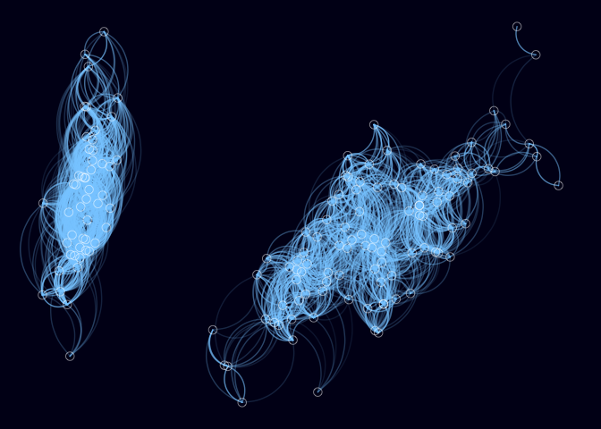

Visualising Clustering with Multidimensional Scaling and ggplot2
================================================================

The script below demonstrates a method for visualising the clustering of
highly dimensional data.

I was motivated to find a nice way to visualise hierarchical clustering
of highly dimensional data. Not being satisfied by the solutions I came
across, I turned to [multidimensional
scaling](https://en.wikipedia.org/wiki/Multidimensional_scaling).
Multidimensional scaling reduces a distance matrix (whether it be
Euclidean distance, correlations, or any of metric), into a particular
number of dimensions. Typically, we reduce to 2 dimensions to visualise
the results in a 2D scatter plot. When plotted, the result is a scatter
plot in which points that are closer together are more similar. This
type of plot is a very useful way to visualise the clustering of data.

The out-of-the-box plot of multidimensional scaling results is pretty
bland. Below is a function for conducting this analysis, and visualising
it in an appealing way after some motivation from a post by Ricardo Bion
([@ricardobion](<https://twitter.com/ricardobion/status/717916814529810432>)).

The below produces a plot in which points represent rows. The proximity
of the points represents their similarity as determined by a distance
metric. Visualisation is supported by the addition of paths (curved
lines) whose alpha (transparency) relates to proximity. Only a certain
proportion of the closest paths are included to make the plot cleaner
and reduce computational requirements.

To reuse, simply assign the variable `d` to your own data. You can also
easily adjust the proportion of paths to be drawn with `prop_draw`.

Currently excluded from this script are simple additions for:

-   Adding labels with `geom_text()`
-   Adjusting aesthetics (e.g., colour or shape) by a cluster number
    determined by the likes of k-means.

Improvements welcome!

    library(dplyr)
    library(purrr)
    library(ggplot2)

    # source the theme_map for ggplot2
    source("https://dl.dropboxusercontent.com/u/2364714/theme_map.R")

    # Useful variables ============================================

    # Data frame of numeric columns to be clustered
    d <- iris %>% keep(is.numeric)

    # Set the proportion of paths to be drawn
    prop_draw <- .08

    # =============================================================

    # Produce a distance matrix.
    # Here using euclideanvia dist()
    # But easily replaceable with others (e.g., absolute value of correlations)
    distance <- d %>%
                  dist() %>%
                  as.matrix()

    # Use multidimensional Scaling to obtain x and y coordinates for points.
    points <- distance %>%
                cmdscale() %>%
                data.frame() %>%
                rename(x = X1, y = X2)

    # Create a proximity matrix of the paths to be plotted.
    # This requires:
    #   1. Pruning the distance matrix to
    #      a. only include a proportion of the closest points (prop_draw).
    #      b. Remove any paths between points with a distance of 0 (as path cannot be drawn).
    #   2. Inversing the values (from distance to proximity).
    #   3. Scaling values within range of 0 - 1 to suit `alpha` in the plot.
    proximity <- distance
    # Step 1a.
    distance[upper.tri(proximity)] <- NA
    diag(proximity) <- NA
    proximity[proximity > quantile(proximity, prop_draw, na.rm = TRUE)] <- NA
    # Step 1b.
    proximity[proximity == 0] <- NA
    # Step 2.
    proximity <- max(proximity, na.rm = TRUE) - proximity
    # Step 3.
    proximity <- (proximity - min(proximity, na.rm = TRUE)) / (max(proximity, na.rm = TRUE) - min(proximity, na.rm = TRUE))
    proximity <- .7 * proximity  # limit path alpha to .7 instead of 1

    # Produce a data frame of data needed for plotting the paths.
    n_paths <- sum(!is.na(proximity))
    paths <- matrix(nrow = n_paths, ncol = 5) %>% data.frame()
    colnames(paths) <- c("x", "y", "xend", "yend", "proximity")

    path <- 1
    for(row in 1:nrow(distance)) {
      for(col in 1:ncol(distance)) {
        path_proximity <- proximity[row, col]
        if (!is.na(path_proximity)) {
          x    <- points$x[row]
          y    <- points$y[row]
          xend <- points$x[col]
          yend <- points$y[col]
          paths[path, ] <- c(x, y, xend, yend, path_proximity)
          path <- path + 1
        }
      }
    }

    # Produce the plot.
    ggplot() +
      # Plot the paths
      geom_curve(data = paths,
                 aes(x = x, y = y, xend = xend, yend = yend, alpha = proximity),
                 color = "skyblue1", show.legend = FALSE) +
      # Plot the points
      geom_point(data = points,
                 aes(x, y),
                 size = 3, alpha = .5, shape = 1, colour = "white") +
      # expand the axes to add space for curves etc
      expand_limits(x = c(min(points$x) - .1 * sd(points$x),
                          max(points$x) + .1 * sd(points$x)),
                    y = c(min(points$y) - .1 * sd(points$y),
                          max(points$y) + .1 * sd(points$y))
                    ) +
      theme_map()

